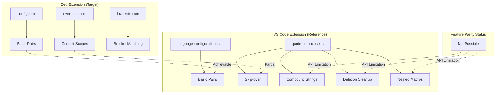

# Design Document: Auto-Closing Pairs Parity

## Overview

This design addresses achieving feature parity between sight-zed (Zed editor extension) and sight (VS Code extension) for auto-closing pairs functionality in Stata files.

### Key Finding: API Limitations

After researching Zed's extension API, a critical limitation was discovered:

**Zed's extension API does NOT support:**
- Custom keystroke handling/interception
- Document change event listeners
- Programmatic text manipulation in response to user input

**Zed's extension API DOES support:**
- Static bracket pair configuration via `config.toml`
- Context-aware bracket behavior via `overrides.scm` and `not_in` scopes
- Language server integration
- Tree-sitter grammar and query configuration

This means the advanced behaviors in the VS Code extension (skip-over, deletion cleanup, compound string transformation) **cannot be implemented** in Zed with the current extension API.

### Implementation Strategy

Given these constraints, this design focuses on:
1. **Maximizing static configuration** - Optimize `config.toml` bracket definitions
2. **Leveraging Tree-sitter scopes** - Use `overrides.scm` for context-aware behavior
3. **Documenting limitations** - Clearly communicate what cannot be achieved
4. **Future-proofing** - Structure for easy enhancement if Zed adds APIs

## Architecture



## Components and Interfaces

### Component 1: Bracket Configuration (`config.toml`)

**Purpose:** Define static auto-closing pairs for Stata syntax.

**Current Configuration:**
```toml
brackets = [
  { start = "{", end = "}", close = true, newline = true },
  { start = "[", end = "]", close = true, newline = false },
  { start = "(", end = ")", close = true, newline = false },
  { start = "\"", end = "\"", close = true, newline = false },
  { start = "`", end = "'", close = true, newline = false },
]
```

**Enhanced Configuration:**
```toml
brackets = [
  { start = "{", end = "}", close = true, newline = true },
  { start = "[", end = "]", close = true, newline = false },
  { start = "(", end = ")", close = true, newline = false },
  { start = "\"", end = "\"", close = true, newline = false, not_in = ["string"] },
  { start = "`", end = "'", close = true, newline = false },
]

autoclose_before = ";:.,=}])>'\" \n\t"
```

**Changes:**
- Add `not_in = ["string"]` to double quotes to prevent auto-closing inside strings
- **Critical fix:** Add apostrophe (`'`) to `autoclose_before` to enable compound string typing
- **Critical fix:** Add double quote (`"`) to `autoclose_before` to enable nested patterns

### Key Discovery: `autoclose_before` Setting

The `autoclose_before` setting controls which characters can appear AFTER the cursor for auto-closing to trigger. The current configuration is missing `'` and `"`, which prevents compound string patterns from working.

**Example - Why `` `"..."' `` doesn't work currently:**
1. User types `` ` `` → Zed inserts `` `|' `` (cursor at `|`)
2. User types `"` → Zed checks if `'` is in `autoclose_before`
3. `'` is NOT in the list → `"` auto-close is BLOCKED
4. Result: `` `"|' `` instead of `` `"|"' ``

**With the fix (`'` added to `autoclose_before`):**
1. User types `` ` `` → Zed inserts `` `|' `` (cursor at `|`)
2. User types `"` → Zed checks if `'` is in `autoclose_before`
3. `'` IS in the list → `"` auto-close TRIGGERS
4. Result: `` `"|"' `` ✓

### Component 2: Syntax Overrides (`overrides.scm`)

**Purpose:** Define syntactic scopes for context-aware bracket behavior.

**New File Content:**
```scheme
; String contexts for bracket override behavior
(string) @string

; Comment contexts
(comment) @comment
(block_comment) @comment
```

This enables the `not_in = ["string"]` configuration to work correctly.

### Component 3: Bracket Matching (`brackets.scm`)

**Purpose:** Define bracket pairs for highlighting and matching.

**Current Configuration:** Already correctly defines all bracket pairs including `` ` `` and `'`.

No changes needed.

## Data Models

### Feature Parity Matrix

| Feature | VS Code | Zed (Current) | Zed (After) | Gap |
|---------|---------|---------------|-------------|-----|
| Basic `{}` auto-close | ✅ | ✅ | ✅ | None |
| Basic `[]` auto-close | ✅ | ✅ | ✅ | None |
| Basic `()` auto-close | ✅ | ✅ | ✅ | None |
| Basic `""` auto-close | ✅ | ✅ | ✅ | None |
| Basic `` `' `` auto-close | ✅ | ✅ | ✅ | None |
| `"` not in strings | ✅ | ❌ | ✅ | Closable |
| Compound `` `"..."' `` typing | ✅ | ❌ | ✅ | Closable (via `autoclose_before`) |
| Nested `` ``'' `` typing | ✅ | ❌ | ✅ | Closable (via `autoclose_before`) |
| Skip-over `'` | ✅ | ❌ | ❌ | API Limitation |
| Skip-over `"` | ✅ | ❌ | ❌ | API Limitation |
| Compound string transformation | ✅ | ❌ | ❌ | API Limitation |
| Deletion cleanup | ✅ | ❌ | ❌ | API Limitation |

**Note:** "Compound `` `"..."' `` typing" means the user can type the sequence and get the right result. "Compound string transformation" refers to VS Code's behavior of transforming `` `' `` into `` `"..."' `` when `"` is typed - this specific transformation isn't needed if basic auto-closing works correctly.

### Zed Extension API Capabilities

```
┌─────────────────────────────────────────────────────────────┐
│                    Zed Extension API                        │
├─────────────────────────────────────────────────────────────┤
│ AVAILABLE:                                                  │
│ • Language server command configuration                     │
│ • Grammar registration (Tree-sitter)                        │
│ • Static language configuration (config.toml)               │
│ • Tree-sitter queries (highlights, brackets, indents, etc.) │
│ • GitHub release asset downloading                          │
│ • File system operations (within extension directory)       │
├─────────────────────────────────────────────────────────────┤
│ NOT AVAILABLE:                                              │
│ • Document change event listeners                           │
│ • Keystroke interception/handling                           │
│ • Programmatic text editing                                 │
│ • Custom commands/actions                                   │
│ • Editor state observation                                  │
└─────────────────────────────────────────────────────────────┘
```

## Correctness Properties

*A property is a characteristic or behavior that should hold true across all valid executions of a system—essentially, a formal statement about what the system should do. Properties serve as the bridge between human-readable specifications and machine-verifiable correctness guarantees.*

Based on the prework analysis, many requirements cannot be tested because they require API capabilities that Zed doesn't provide. The testable properties focus on static configuration correctness.

### Property 1: Bracket Configuration Correctness

*For any* bracket pair defined in `config.toml` with `close = true`, typing the opening character in a valid context SHALL result in the closing character being inserted after the cursor.

**Validates: Requirements 1.1, 1.2, 1.3, 1.5**

### Property 2: Context-Aware Double Quote Behavior

*For any* position inside a string literal (as defined by Tree-sitter), typing `"` SHALL NOT auto-insert a closing `"`. *For any* position outside a string literal, typing `"` SHALL auto-insert a closing `"`.

**Validates: Requirements 1.4**

### Property 3: Backtick Auto-Close in All Contexts

*For any* position in a Stata file (including inside strings and comments), typing `` ` `` SHALL auto-insert a closing `'`.

**Validates: Requirements 6.1, 6.2**

### Property 4: Compound String Typing Sequence

*For any* empty document, typing the sequence `` ` `` then `"` SHALL result in `` `"|"' `` where `|` represents the cursor position. The `autoclose_before` setting must include `'` to enable this.

**Validates: Requirements 4.1, 4.2**

### Property 5: Nested Backtick Typing Sequence

*For any* position inside a local macro (between `` ` `` and `'`), typing `` ` `` SHALL auto-insert `'`, resulting in nested delimiters.

**Validates: Requirements 3.1, 3.2**

### Untestable Requirements (API Limitations)

The following requirements cannot be implemented or tested due to Zed extension API limitations:

| Requirement | Feature | Reason |
|-------------|---------|--------|
| 2.1, 2.2, 2.3 | Skip-over behavior | Requires keystroke interception |
| 5.1, 5.2, 5.3 | Deletion cleanup | Requires deletion event handling |
| 6.3, 6.4 | Multi-cursor/selection | Built-in Zed behavior |

**Note:** Requirements 3.x and 4.x (nested macros and compound strings) ARE achievable through proper `autoclose_before` configuration, not through custom keystroke handling.

## Error Handling

### Configuration Errors

| Error Condition | Handling |
|-----------------|----------|
| Invalid TOML syntax in `config.toml` | Zed will fail to load language configuration; user sees error |
| Invalid Tree-sitter query in `overrides.scm` | Zed will ignore the query; bracket behavior falls back to defaults |
| Missing `overrides.scm` file | Context-aware behavior (`not_in`) will not work |

### Runtime Behavior

Since this implementation uses only static configuration, there are no runtime errors to handle. All behavior is determined at extension load time.

## Testing Strategy

### Dual Testing Approach

Given the static nature of this implementation, testing focuses on:

1. **Configuration Validation Tests** (Unit Tests)
   - Verify TOML syntax is valid
   - Verify Tree-sitter query syntax is valid
   - Verify all required fields are present

2. **Behavioral Verification Tests** (Manual/Integration)
   - Verify each bracket pair auto-closes correctly
   - Verify context-aware behavior works (double quotes in strings)
   - Verify no conflicts with Zed's built-in behavior

### Test Configuration

Since Zed extensions don't have a built-in test framework, testing will be:

1. **Static Analysis**: Validate configuration file syntax
2. **Manual Testing**: Verify behavior in Zed editor
3. **Documentation**: Provide test cases for manual verification

### Manual Test Cases

```markdown
## Test Case 1: Basic Bracket Auto-Close
1. Open a new `.do` file in Zed
2. Type `{` - verify `}` is inserted, cursor between them
3. Type `[` - verify `]` is inserted, cursor between them
4. Type `(` - verify `)` is inserted, cursor between them
5. Type `` ` `` - verify `'` is inserted, cursor between them

## Test Case 2: Double Quote Context Awareness
1. Open a new `.do` file in Zed
2. Type `"` outside any string - verify `"` is inserted
3. Inside the string, type `"` - verify NO additional `"` is inserted

## Test Case 3: Backtick in String Context
1. Open a new `.do` file in Zed
2. Type `"` to start a string
3. Inside the string, type `` ` `` - verify `'` is inserted

## Test Case 4: Compound String Typing (Critical)
1. Open a new `.do` file in Zed
2. Type `` ` `` - verify you get `` `|' `` (cursor at |)
3. Type `"` - verify you get `` `"|"' `` (cursor between the quotes)
4. Type `hello` - verify you get `` `"hello|"' ``
5. Final result should be a valid Stata compound string

## Test Case 5: Nested Local Macro Typing
1. Open a new `.do` file in Zed
2. Type `` ` `` - verify you get `` `|' ``
3. Move cursor to be between `` ` `` and `'`
4. Type `` ` `` again - verify you get `` ``|'' `` (nested backticks)

## Test Case 6: Local Macro Inside Compound String
1. Open a new `.do` file in Zed
2. Type `` ` `` then `"` to get `` `"|"' ``
3. Type `` ` `` - verify you get `` `"`|'"' `` (local macro inside compound string)
```

## Implementation Notes

### Files to Modify

1. **`sight-zed/languages/stata/config.toml`**
   - Add `not_in = ["string"]` to double quote bracket definition
   - Verify `autoclose_before` includes necessary characters

2. **`sight-zed/languages/stata/overrides.scm`** (NEW FILE)
   - Define `@string` scope for string literals
   - Define `@comment` scope for comments

### Files Unchanged

- `sight-zed/languages/stata/brackets.scm` - Already correct
- `sight-zed/languages/stata/highlights.scm` - Not related
- `sight-zed/languages/stata/indents.scm` - Not related
- `sight-zed/src/lib.rs` - No API for custom behavior

### Future Considerations

If Zed adds extension API support for:
- Document change events
- Keystroke interception
- Programmatic text editing

Then the following features could be implemented:
- Skip-over behavior for closing characters
- Compound string transformation
- Deletion cleanup
- Nested macro handling

The design should be revisited when these APIs become available.
