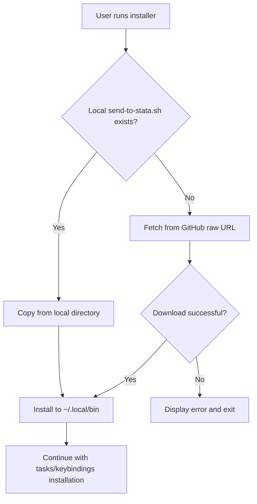

# Design Document: Curl-Pipe Installer Support

## Overview

This design adds curl-pipe-to-bash installation support to `install-send-to-stata.sh`. The installer will detect its execution context by checking for the presence of local files, then either copy from the local directory (existing behavior) or fetch from GitHub raw URLs (new behavior).

The implementation follows a simple detection-and-branch pattern that preserves all existing functionality while adding the remote fetch capability.

## Architecture



### Execution Contexts

1. **Local Clone Context**: User has cloned the repository and runs `./install-send-to-stata.sh`
   - `$SCRIPT_DIR/send-to-stata.sh` exists
   - Use existing `cp` behavior

2. **Curl-Pipe Context**: User runs `/bin/bash -c "$(curl -fsSL <url>)"`
   - Script runs in a temporary context with no local files
   - `$SCRIPT_DIR` points to a temp directory or doesn't contain the script
   - Fetch from GitHub raw URL

### Detection Strategy

The detection uses file existence checking rather than environment variable inspection because:
- It's reliable across different shell invocation methods
- It handles edge cases like running from a partial clone
- It's simple to implement and understand

## Components and Interfaces

### Modified Functions

#### `install_script()`

The existing `install_script()` function will be modified to:

1. Check if `$SCRIPT_DIR/send-to-stata.sh` exists
2. If yes: copy from local (existing behavior)
3. If no: call new `fetch_script_from_github()` function

```bash
install_script() {
  # Create install directory if needed
  if [[ ! -d "$INSTALL_DIR" ]]; then
    mkdir -p "$INSTALL_DIR"
    print_success "Created $INSTALL_DIR"
  fi

  # Determine source: local file or GitHub
  local source_script="$SCRIPT_DIR/send-to-stata.sh"
  
  if [[ -f "$source_script" ]]; then
    # Local clone: copy from directory
    cp "$source_script" "$INSTALL_DIR/"
    print_success "Installed send-to-stata.sh to $INSTALL_DIR (from local)"
  else
    # Curl-pipe: fetch from GitHub
    fetch_script_from_github
  fi

  chmod +x "$INSTALL_DIR/send-to-stata.sh"
  
  # ... rest of PATH configuration (unchanged)
}
```

### New Functions

#### `fetch_script_from_github()`

New function to download the script from GitHub:

```bash
# GitHub raw URL components
GITHUB_RAW_BASE="https://raw.githubusercontent.com/jbearak/sight"
GITHUB_REF="${SIGHT_GITHUB_REF:-main}"

fetch_script_from_github() {
  local url="$GITHUB_RAW_BASE/$GITHUB_REF/send-to-stata.sh"
  print_info "Fetching send-to-stata.sh from GitHub ($GITHUB_REF)..."
  
  if ! curl -fsSL "$url" -o "$INSTALL_DIR/send-to-stata.sh"; then
    print_error "Failed to download send-to-stata.sh from GitHub"
    echo ""
    echo "URL: $url"
    echo ""
    echo "Check your internet connection and try again, or install from a local clone:"
    echo "  git clone https://github.com/jbearak/sight.git"
    echo "  cd sight && ./install-send-to-stata.sh"
    exit 1
  fi
  
  print_success "Installed send-to-stata.sh to $INSTALL_DIR (from GitHub)"
}
```

### Constants

New constant added at the top of the script:

```bash
GITHUB_RAW_BASE="https://raw.githubusercontent.com/jbearak/sight"
GITHUB_REF="${SIGHT_GITHUB_REF:-main}"
```

The URL is constructed as `$GITHUB_RAW_BASE/$GITHUB_REF/send-to-stata.sh`.

### Environment Variable Override

The `SIGHT_GITHUB_REF` environment variable allows testing against a branch before merging to main:

```bash
# Test against a feature branch
SIGHT_GITHUB_REF=feature-branch /bin/bash -c "$(curl -fsSL https://raw.githubusercontent.com/jbearak/sight/feature-branch/install-send-to-stata.sh)"

# Or export for multiple tests
export SIGHT_GITHUB_REF=my-branch
./install-send-to-stata.sh
```

This enables:
1. **Pre-merge testing**: Test curl-pipe installation from a feature branch
2. **Version pinning**: Install from a specific tag or commit
3. **Development**: Test changes without pushing to main

## Data Models

This feature doesn't introduce new data structures. It operates on:

- **File paths**: Strings representing local and remote file locations
- **Exit codes**: Integer status codes (0 for success, 1 for failure)

## Correctness Properties

*A property is a characteristic or behavior that should hold true across all valid executions of a system—essentially, a formal statement about what the system should do. Properties serve as the bridge between human-readable specifications and machine-verifiable correctness guarantees.*

Based on the prework analysis, most acceptance criteria are specific scenarios (examples) rather than universal properties. The key testable property is installation parity.

### Property 1: Installation Parity

*For any* successful installation (whether from local clone or curl-pipe), the resulting `~/.local/bin/send-to-stata.sh` file SHALL be identical to the canonical `send-to-stata.sh` from the repository.

**Validates: Requirements 5.1**

### Example-Based Tests

The following acceptance criteria are better tested as specific examples rather than properties:

| Criteria | Test Type | Description |
|----------|-----------|-------------|
| 1.1, 1.2 | Example | Detection logic with/without local file |
| 2.1 | Example | Local copy produces correct file |
| 3.1, 3.2 | Example | Remote fetch uses correct URL |
| 3.3, 3.4 | Example | Download success/failure handling |
| 4.1, 4.2 | Integration | End-to-end curl-pipe installation |

## Error Handling

### Download Failures

When `curl` fails to download the script:

1. **Detection**: Check curl's exit code (non-zero indicates failure)
2. **User Feedback**: Display clear error message explaining the failure
3. **Recovery Guidance**: Suggest alternative installation via git clone
4. **Exit**: Return non-zero exit code (1)

```bash
if ! curl -fsSL "$GITHUB_RAW_URL" -o "$INSTALL_DIR/send-to-stata.sh"; then
  print_error "Failed to download send-to-stata.sh from GitHub"
  echo ""
  echo "Check your internet connection and try again, or install from a local clone:"
  echo "  git clone https://github.com/jbearak/sight.git"
  echo "  cd sight && ./install-send-to-stata.sh"
  exit 1
fi
```

### Curl Flags

The `-fsSL` flags provide appropriate error handling:
- `-f`: Fail silently on HTTP errors (returns non-zero exit code)
- `-s`: Silent mode (no progress meter)
- `-S`: Show errors even in silent mode
- `-L`: Follow redirects

### Network Issues

Common failure scenarios:
- No internet connection → curl fails with connection error
- GitHub is down → curl fails with HTTP error
- URL is wrong → curl fails with 404

All these result in non-zero exit code and trigger the error handling path.

## Testing Strategy

### Unit Tests (Example-Based)

Shell script testing using a test harness that:
1. Creates temporary directories for isolation
2. Mocks external dependencies where needed
3. Verifies expected outcomes

**Test Cases:**

1. **Detection - Local File Present**
   - Setup: Create temp dir with `send-to-stata.sh`
   - Action: Check if file exists
   - Verify: Detection returns true

2. **Detection - Local File Absent**
   - Setup: Create empty temp dir
   - Action: Check if file exists
   - Verify: Detection returns false

3. **Local Install**
   - Setup: Create temp dir with known `send-to-stata.sh` content
   - Action: Run install_script function
   - Verify: File copied to install location with correct content

4. **Remote Install - Success**
   - Setup: Empty temp dir, mock successful curl
   - Action: Run install_script function
   - Verify: File downloaded to install location

5. **Remote Install - Failure**
   - Setup: Empty temp dir, mock failed curl
   - Action: Run install_script function
   - Verify: Error message displayed, exit code 1

6. **URL Constant**
   - Action: Grep script for GITHUB_RAW_URL
   - Verify: URL matches expected value

### Integration Tests

**Testing Before Merge to Main:**

The `SIGHT_GITHUB_REF` environment variable enables testing curl-pipe installation from a feature branch:

```bash
# 1. Push your changes to a feature branch
git push origin feature/curl-pipe-installer

# 2. Test curl-pipe installation from that branch
SIGHT_GITHUB_REF=feature/curl-pipe-installer /bin/bash -c "$(curl -fsSL https://raw.githubusercontent.com/jbearak/sight/feature/curl-pipe-installer/install-send-to-stata.sh)"

# 3. Verify installation
test -x "$HOME/.local/bin/send-to-stata.sh" && echo "Success"
```

**End-to-End Curl-Pipe Test (after merge):**
```bash
# Test curl-pipe installation (requires network)
/bin/bash -c "$(curl -fsSL https://raw.githubusercontent.com/jbearak/sight/main/install-send-to-stata.sh)"

# Verify installation
test -x "$HOME/.local/bin/send-to-stata.sh"
```

### Property Test

**Installation Parity Test:**
```bash
# Install via both methods, compare results
# Method 1: Local clone
git clone https://github.com/jbearak/sight.git /tmp/sight-local
/tmp/sight-local/install-send-to-stata.sh
cp "$HOME/.local/bin/send-to-stata.sh" /tmp/local-installed.sh

# Method 2: Curl-pipe (after uninstall)
/bin/bash -c "$(curl -fsSL https://raw.githubusercontent.com/jbearak/sight/main/install-send-to-stata.sh)"
cp "$HOME/.local/bin/send-to-stata.sh" /tmp/curl-installed.sh

# Compare
diff /tmp/local-installed.sh /tmp/curl-installed.sh
```

### Test Configuration

- Manual testing recommended for integration tests (require network, modify user config)
- Unit tests can be automated in CI with mocked curl
- Property test validates parity but requires both installation methods to succeed first
