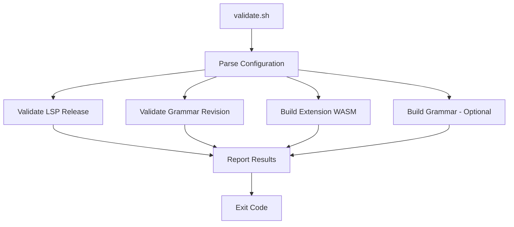

# Design Document: Extension Build Validation

## Overview

This design describes a test suite that validates the Sight Zed extension can build successfully with its specified LSP and tree-sitter grammar revisions. The suite is implemented as a shell script that can be run locally or in CI, performing HTTP checks against GitHub APIs and executing build commands.

## Architecture

The validation suite follows a simple sequential architecture:



The script extracts configuration from source files, performs validations via GitHub API calls and build commands, then reports results with an appropriate exit code.

## Components and Interfaces

### Component 1: Configuration Parser

Extracts version and revision information from extension source files.

```bash
# Extract SERVER_VERSION from src/lib.rs
# Input: src/lib.rs file
# Output: Version string (e.g., "v0.1.11")
extract_server_version() {
    grep -oP 'const SERVER_VERSION: &str = "\K[^"]+' src/lib.rs
}

# Extract grammar revision from extension.toml
# Input: extension.toml file
# Output: Commit SHA string
extract_grammar_revision() {
    grep -A1 '\[grammars.stata\]' extension.toml | grep 'rev' | grep -oP 'rev = "\K[^"]+'
}
```

### Component 2: LSP Release Validator

Verifies the specified LSP version exists as a GitHub release with all required binary assets.

```bash
# Validate LSP release exists with required assets
# Input: Version tag (e.g., "v0.1.11")
# Output: 0 on success, 1 on failure
validate_lsp_release() {
    local version="$1"
    local repo="jbearak/sight"
    local required_assets=(
        "sight-darwin-arm64"
        "sight-linux-arm64"
        "sight-linux-x64"
        "sight-windows-x64.exe"
        "sight-windows-arm64.exe"
    )
    
    # Fetch release info from GitHub API
    # Check each required asset exists
    # Report missing assets
}
```

### Component 3: Grammar Revision Validator

Verifies the specified commit SHA exists in the tree-sitter-stata repository.

```bash
# Validate grammar revision exists
# Input: Commit SHA
# Output: 0 on success, 1 on failure
validate_grammar_revision() {
    local revision="$1"
    local repo="jbearak/tree-sitter-stata"
    
    # Query GitHub API for commit
    # Return success/failure based on response
}
```

### Component 4: Extension Build Validator

Builds the extension as WASM and verifies the output.

```bash
# Build extension and verify output
# Output: 0 on success, 1 on failure
validate_extension_build() {
    # Run cargo build --release --target wasm32-wasip1
    # Check for output file existence
    # Report file size
}
```

### Component 5: Grammar Build Validator (Required)

Clones and builds the grammar from the specified revision to WASM, simulating what Zed does during extension installation.

```bash
# Build grammar from specified revision
# Input: Commit SHA
# Output: 0 on success, 1 on failure
validate_grammar_build() {
    local revision="$1"
    local repo="jbearak/tree-sitter-stata"
    local tmpdir=$(mktemp -d)
    
    # Clone at specific revision
    git clone --depth 1 "https://github.com/$repo" "$tmpdir"
    cd "$tmpdir"
    git fetch origin "$revision"
    git checkout "$revision"
    
    # Build grammar to WASM (same as Zed does)
    tree-sitter build --wasm
    
    # Verify output
    if [[ -f "*.wasm" ]]; then
        echo "PASS: Grammar compiled successfully"
        rm -rf "$tmpdir"
        return 0
    else
        echo "FAIL: Grammar WASM not produced"
        rm -rf "$tmpdir"
        return 1
    fi
}
```

## Main Entry Point

Orchestrates validation execution and result reporting.

```bash
# Main script entry point
# Supports flags: --all, --lsp, --grammar-rev, --build, --grammar-build
# Default (no flags): runs all validations including grammar build
main() {
    # Parse arguments
    # Run requested validations
    # Grammar build is REQUIRED by default (prevents Zed install failures)
    # Aggregate results
    # Exit with appropriate code
}
```

## Data Models

### Validation Result

```bash
# Each validation produces:
# - Status: PASS or FAIL
# - Message: Human-readable description
# - Details: Additional context (e.g., missing assets, error output)
```

### Configuration Data

| Field | Source | Example |
|-------|--------|---------|
| LSP Version | `src/lib.rs` SERVER_VERSION | `v0.1.11` |
| Grammar Repo | `extension.toml` repository | `https://github.com/jbearak/tree-sitter-stata` |
| Grammar Revision | `extension.toml` rev | `872da1d652dd32cc871ea4a3c3f84bdea7c68c8c` |

## Correctness Properties

*A property is a characteristic or behavior that should hold true across all valid executions of a system—essentially, a formal statement about what the system should do. Properties serve as the bridge between human-readable specifications and machine-verifiable correctness guarantees.*

Based on the acceptance criteria analysis, the following properties are testable:

**Property 1: Version extraction consistency**
*For any* valid `src/lib.rs` file containing a SERVER_VERSION constant with arbitrary version strings, the extracted version string SHALL exactly match the literal value between the quotes in the source file.
**Validates: Requirements 1.1, 6.1**

**Property 2: Revision extraction consistency**
*For any* valid `extension.toml` file containing a `[grammars.stata]` section with a `rev` field, the extracted revision SHALL exactly match the literal commit SHA value in the file.
**Validates: Requirements 2.1, 6.2**

**Property 3: Asset completeness identification**
*For any* set of assets returned from a GitHub release API response, the validator SHALL correctly identify exactly which required assets are present and which are missing from the required set `{sight-darwin-arm64, sight-linux-arm64, sight-linux-x64, sight-windows-x64.exe, sight-windows-arm64.exe}`.
**Validates: Requirements 1.3, 1.5**

**Property 4: Exit code correctness**
*For any* execution of the validator where N validations are requested, the exit code SHALL be 0 if and only if all N validations pass; otherwise the exit code SHALL be non-zero.
**Validates: Requirements 5.3, 5.4**

**Property 5: Version prefix handling**
*For any* version string extracted from source, the validator SHALL handle both "vX.Y.Z" and "X.Y.Z" formats consistently when querying GitHub releases.
**Validates: Requirements 6.4**

## Error Handling

| Error Condition | Handling Strategy |
|-----------------|-------------------|
| Missing `src/lib.rs` | Exit with error, report file not found |
| Missing `extension.toml` | Exit with error, report file not found |
| SERVER_VERSION not found in source | Exit with error, report parsing failure |
| Grammar revision not found in TOML | Exit with error, report parsing failure |
| GitHub API rate limit | Report rate limit error, suggest using GITHUB_TOKEN |
| GitHub API network error | Report network error with details |
| Release not found (404) | Report missing release with version |
| Commit not found (404) | Report invalid revision with SHA |
| Cargo build failure | Report build error output |
| Missing wasm32-wasip1 target | Report missing target, suggest `rustup target add` |
| tree-sitter CLI not found | Exit with error, report missing dependency |
| Grammar WASM build failure | Report full build output, this prevents Zed install |
| Git clone failure | Report network/auth error |

## Testing Strategy

### Unit Testing Approach

The validation script will be tested through:

1. **Example-based tests**: Specific test cases for each validation function
2. **Integration tests**: End-to-end runs against the actual repository

### Test Cases

| Test | Description | Expected Result |
|------|-------------|-----------------|
| Extract valid version | Parse `src/lib.rs` with valid SERVER_VERSION | Returns version string |
| Extract valid revision | Parse `extension.toml` with valid rev | Returns commit SHA |
| Validate existing release | Check known good release version | PASS |
| Validate missing release | Check non-existent version | FAIL with error |
| Validate existing commit | Check known good commit SHA | PASS |
| Validate invalid commit | Check non-existent SHA | FAIL with error |
| Build extension | Run cargo build | PASS (if toolchain installed) |
| All validations pass | Run full suite | Exit code 0 |
| One validation fails | Run with bad version | Exit code non-zero |

### Property-Based Testing

Property tests will verify:
- Version extraction handles various formatting (with/without quotes, whitespace)
- Exit codes correctly reflect validation outcomes
- Asset checking correctly identifies all missing assets

Test framework: Shell-based tests using `bats` (Bash Automated Testing System) or simple shell assertions.
