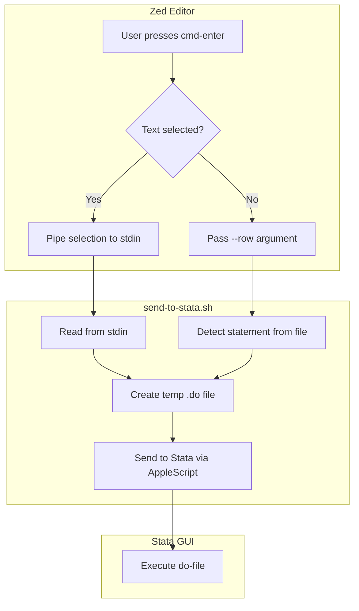

# Design Document: Robust Compound String Handling

## Overview

This design addresses the shell metacharacter problem when passing Stata code from Zed to the `send-to-stata.sh` script. The core issue is that command-line arguments are subject to shell interpretation, causing backticks (command substitution) and quotes to break the command structure.

The solution introduces a **stdin input mode** where selected text is piped to the script rather than passed as an argument. This bypasses shell interpretation entirely since piped data is not processed by the shell.

### Key Design Decisions

1. **Stdin over environment variables**: Environment variables still require shell escaping in some contexts. Stdin is the cleanest solution.
2. **Conditional stdin usage**: Only use stdin when there's selected text; fall back to `--row` when no selection exists.
3. **Backward compatibility**: The `--text` argument remains functional for simple cases or programmatic use.

## Architecture



### Data Flow

1. **With selection (stdin mode)**:
   - Zed task: `echo "$ZED_SELECTED_TEXT" | send-to-stata.sh --statement --stdin --file "$ZED_FILE"`
   - Script reads stdin, creates temp file, sends to Stata

2. **Without selection (row mode)**:
   - Zed task: `send-to-stata.sh --statement --file "$ZED_FILE" --row "$ZED_ROW"`
   - Script detects statement at row, creates temp file, sends to Stata

## Components and Interfaces

### Modified Components

#### 1. Argument Parser (`parse_arguments`)

**Changes**:
- Add `--stdin` flag recognition
- Track `STDIN_MODE` boolean variable
- Validate mutual exclusivity with `--text`

**Interface**:
```bash
# New global variable
STDIN_MODE=false

# Updated parse_arguments function
parse_arguments() {
    # ... existing code ...
    case "$1" in
        --stdin)
            STDIN_MODE=true
            shift
            ;;
        # ... existing cases ...
    esac
}
```

#### 2. Argument Validator (`validate_arguments`)

**Changes**:
- Check for `--stdin` and `--text` mutual exclusivity
- Allow `--stdin` as alternative to `--text` or `--row` in statement mode

**Interface**:
```bash
validate_arguments() {
    # Check mutual exclusivity
    if [[ "$STDIN_MODE" == true && -n "$TEXT" ]]; then
        echo "Error: --stdin and --text are mutually exclusive" >&2
        exit 1
    fi
    
    # For statement mode, need one of: --stdin, --text, or --row
    if [[ "$MODE" == "statement" ]]; then
        if [[ "$STDIN_MODE" != true && -z "$TEXT" && -z "$ROW" ]]; then
            echo "Error: --statement mode requires --stdin, --text, or --row" >&2
            exit 1
        fi
    fi
}
```

#### 3. Stdin Reader (New Function)

**Purpose**: Read arbitrary content from stdin without interpretation

**Interface**:
```bash
# Reads all content from stdin
# Returns: content via stdout
# Exit: 6 on read failure
read_stdin_content() {
    local content
    if ! content=$(cat); then
        echo "Error: Failed to read from stdin" >&2
        exit 6
    fi
    printf '%s' "$content"
}
```

#### 4. Main Entry Point (`main`)

**Changes**:
- Check `STDIN_MODE` before `TEXT` in statement mode
- Call `read_stdin_content()` when stdin mode is active

**Interface**:
```bash
main() {
    # ... existing setup ...
    
    case "$MODE" in
        statement)
            if [[ "$STDIN_MODE" == true ]]; then
                local stdin_content
                stdin_content=$(read_stdin_content)
                if [[ -n "$stdin_content" ]]; then
                    code_to_send="$stdin_content"
                elif [[ -n "$ROW" ]]; then
                    # Fall back to row detection if stdin is empty
                    code_to_send=$(detect_statement "$FILE_PATH" "$ROW")
                else
                    echo "Error: stdin is empty and no --row provided" >&2
                    exit 1
                fi
            elif [[ -n "$TEXT" ]]; then
                code_to_send="$TEXT"
            else
                code_to_send=$(detect_statement "$FILE_PATH" "$ROW")
            fi
            ;;
        # ... file mode unchanged ...
    esac
    
    # ... rest unchanged ...
}
```

### New Exit Code

| Code | Meaning |
|------|---------|
| 6 | Stdin read failed |

### Zed Task Updates

#### Current Task (problematic)
```json
{
  "label": "Stata: Send Statement",
  "command": "send-to-stata.sh --statement --file \"$ZED_FILE\" --row \"$ZED_ROW\" --text \"${ZED_SELECTED_TEXT:}\""
}
```

#### New Task (robust)
```json
{
  "label": "Stata: Send Statement",
  "command": "if [ -n \"$ZED_SELECTED_TEXT\" ]; then printf '%s' \"$ZED_SELECTED_TEXT\" | send-to-stata.sh --statement --stdin --file \"$ZED_FILE\"; else send-to-stata.sh --statement --file \"$ZED_FILE\" --row \"$ZED_ROW\"; fi"
}
```

**Rationale**:
- Uses `printf '%s'` instead of `echo` to avoid interpretation of escape sequences
- Conditional logic in shell to choose between stdin and row modes
- The `$ZED_SELECTED_TEXT` variable is expanded by Zed before shell execution, but piping it avoids the quoting issues

## Data Models

### Input Modes

```
┌─────────────────────────────────────────────────────────────┐
│                    Input Mode Selection                      │
├─────────────────────────────────────────────────────────────┤
│                                                              │
│  --statement mode:                                           │
│    Priority: --stdin > --text > --row                        │
│                                                              │
│    1. If --stdin: read from stdin                            │
│       - If stdin non-empty: use stdin content                │
│       - If stdin empty AND --row: detect from file           │
│       - If stdin empty AND no --row: error                   │
│                                                              │
│    2. If --text: use text argument (legacy)                  │
│                                                              │
│    3. If --row: detect statement from file                   │
│                                                              │
│  --file mode:                                                │
│    Always reads entire file (unchanged)                      │
│                                                              │
└─────────────────────────────────────────────────────────────┘
```

### State Variables

| Variable | Type | Description |
|----------|------|-------------|
| `MODE` | string | "statement" or "file" |
| `FILE_PATH` | string | Path to source .do file |
| `ROW` | integer | Cursor row (1-indexed) |
| `TEXT` | string | Text from --text argument |
| `STDIN_MODE` | boolean | Whether --stdin flag was provided |


## Correctness Properties

*A property is a characteristic or behavior that should hold true across all valid executions of a system—essentially, a formal statement about what the system should do. Properties serve as the bridge between human-readable specifications and machine-verifiable correctness guarantees.*

### Property 1: Stdin Content Round-Trip Preservation

*For any* input string (including strings containing shell metacharacters like backticks, quotes, and dollar signs), piping the string to the script via stdin with `--stdin` flag SHALL result in a temp file containing the exact same byte sequence.

**Validates: Requirements 1.1, 1.2, 1.3, 4.1, 4.2, 4.3**

**Rationale**: This is the core property that ensures compound strings and other special characters are preserved. By testing with randomly generated strings containing various metacharacters, we verify the stdin mechanism bypasses shell interpretation entirely.

### Property 2: Backward Compatibility with --text

*For any* input string passed via the `--text` argument (without `--stdin`), the script SHALL produce the same temp file content as the current implementation.

**Validates: Requirements 2.1, 2.2**

**Rationale**: Existing workflows using `--text` must continue to work. This property ensures we don't break backward compatibility.

## Error Handling

### Error Conditions

| Condition | Exit Code | Message |
|-----------|-----------|---------|
| `--stdin` and `--text` both provided | 1 | "Error: --stdin and --text are mutually exclusive" |
| Stdin empty and no `--row` provided | 1 | "Error: stdin is empty and no --row provided" |
| Stdin read failure | 6 | "Error: Failed to read from stdin" |

### Error Handling Strategy

1. **Argument validation**: Check for mutually exclusive options before any I/O operations
2. **Stdin validation**: After reading stdin, check if content is empty and handle fallback
3. **Cleanup**: The existing temp file creation handles cleanup on failure

## Testing Strategy

### Dual Testing Approach

This feature requires both unit tests and property-based tests:

- **Unit tests**: Verify specific examples, edge cases, and error conditions
- **Property tests**: Verify universal properties across randomly generated inputs

### Unit Tests

1. **Argument parsing tests**:
   - `--stdin` flag is recognized
   - `--stdin` and `--text` mutual exclusivity error
   - `--stdin` with `--row` fallback when stdin empty

2. **Integration tests**:
   - Stdin mode with simple content
   - Stdin mode with compound strings (`` `"test"' ``)
   - Stdin mode with various metacharacters

### Property-Based Tests

Property tests will use the existing BATS framework with randomized inputs.

**Configuration**:
- Minimum 100 iterations per property test
- Each test tagged with: **Feature: robust-compound-strings, Property N: [description]**

**Property 1 Test Strategy**:
- Generate random strings containing:
  - Backticks (`` ` ``)
  - Single quotes (`'`)
  - Double quotes (`"`)
  - Dollar signs (`$`)
  - Backslashes (`\`)
  - Newlines
  - Compound string patterns (`` `"..."' ``)
- Pipe to script with `--stdin`
- Verify temp file content matches input exactly

**Property 2 Test Strategy**:
- Generate random strings (simple ASCII, no metacharacters)
- Pass via `--text` argument
- Verify temp file content matches input
- Compare behavior with and without `--stdin` available

### Test File Organization

```
tests/
├── send_to_stata.bats           # Add stdin unit tests
├── send_to_stata_props.bats     # Add stdin property tests
└── fixtures/
    └── compound_strings.do      # New fixture with compound strings
```
