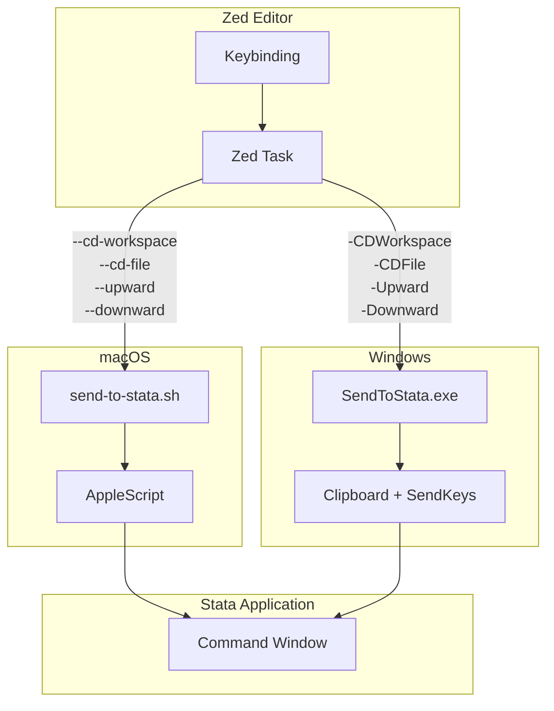

# Design Document: Stata Zed Tasks

## Overview

This design extends the existing send-to-stata infrastructure to add four new Zed tasks for Stata developers:
1. **CD into Workspace Folder** - Changes Stata's working directory to the workspace root
2. **CD into File Folder** - Changes Stata's working directory to the current file's directory
3. **Do Upward Lines** - Executes all lines from file start to cursor position
4. **Do Downward Lines** - Executes all lines from cursor position to file end

The implementation follows the existing architecture pattern: shell scripts/executables handle the core logic, Zed tasks invoke them with appropriate parameters, and keybindings provide quick access.

## Architecture



### Data Flow

1. User presses keybinding or invokes task
2. Zed spawns shell command with environment variables (`$ZED_FILE`, `$ZED_ROW`, `$ZED_WORKTREE_ROOT`)
3. Script/executable processes the request:
   - For CD commands: generates escaped `cd` command
   - For upward/downward: extracts lines and writes to temp file
4. Command sent to Stata via platform-specific mechanism
5. Stata executes the command

## Components and Interfaces

### 1. Path Escaping Module

Handles escaping paths for Stata's `cd` command.

```typescript
// Pseudocode interface
interface PathEscapeResult {
    escaped: string;      // Path with backslashes doubled
    use_compound: boolean; // True if path contains double quotes
}

function escape_path_for_stata(path: string): PathEscapeResult;
function format_cd_command(directory_path: string): string;
```

**Implementation Details:**
- Double all backslashes (`\` → `\\`) for Windows path compatibility
- If path contains `"`, set `use_compound = true`
- Format: `cd "path"` or `` cd `"path"' `` (compound string)

### 2. Line Extraction Module

Extracts lines for upward/downward execution.

```typescript
// Pseudocode interface
interface LineBounds {
    start_line: number;  // 1-indexed, inclusive
    end_line: number;    // 1-indexed, inclusive
}

function get_upward_bounds(file_path: string, row: number): LineBounds;
function get_downward_bounds(file_path: string, row: number): LineBounds;
function ends_with_continuation(line: string): boolean;
```

**Implementation Details:**
- `ends_with_continuation`: checks if line ends with `///` followed by optional whitespace
- `get_upward_bounds`: 
  - Start at line 1
  - End at cursor row, extended forward if cursor line has continuation
- `get_downward_bounds`:
  - Start at cursor row, extended backward if on continuation line
  - End at last line of file

### 3. macOS Shell Script Extensions

New modes added to `send-to-stata.sh`:

| Mode | Description | Required Args |
|------|-------------|---------------|
| `--cd-workspace` | CD to workspace root | `--workspace <path>` |
| `--cd-file` | CD to file's directory | `--file <path>` |
| `--upward` | Execute lines 1 to row | `--file <path>`, `--row <n>` |
| `--downward` | Execute lines row to EOF | `--file <path>`, `--row <n>` |

### 4. Windows Executable Extensions

New parameters added to `SendToStata.cs`:

| Parameter | Description | Required With |
|-----------|-------------|---------------|
| `-CDWorkspace` | CD to workspace root | `-Workspace <path>` |
| `-CDFile` | CD to file's directory | `-File <path>` |
| `-Upward` | Execute lines 1 to row | `-File <path>`, `-Row <n>` |
| `-Downward` | Execute lines row to EOF | `-File <path>`, `-Row <n>` |

### 5. Zed Task Definitions

New tasks to be added:

```json
{
  "label": "Stata: CD into Workspace Folder",
  "command": "send-to-stata.sh --cd-workspace --workspace \"$ZED_WORKTREE_ROOT\""
},
{
  "label": "Stata: CD into File Folder",
  "command": "send-to-stata.sh --cd-file --file \"$ZED_FILE\""
},
{
  "label": "Stata: Do Upward Lines",
  "command": "send-to-stata.sh --upward --file \"$ZED_FILE\" --row \"$ZED_ROW\""
},
{
  "label": "Stata: Do Downward Lines",
  "command": "send-to-stata.sh --downward --file \"$ZED_FILE\" --row \"$ZED_ROW\""
}
```

### 6. Keybinding Definitions

Suggested keybindings (macOS / Windows):

| Action | macOS | Windows |
|--------|-------|---------|
| CD Workspace | `ctrl-shift-w` | `ctrl-shift-w` |
| CD File | `ctrl-shift-f` | `ctrl-shift-f` |
| Do Upward | `ctrl-shift-up` | `ctrl-shift-up` |
| Do Downward | `ctrl-shift-down` | `ctrl-shift-down` |

## Data Models

### PathEscapeResult (Bash)

```bash
# Returns via stdout: "escaped_path|use_compound"
# use_compound is "true" or "false"
escape_path_for_stata() {
    local path="$1"
    local escaped="${path//\\/\\\\}"  # Double backslashes
    local use_compound="false"
    if [[ "$path" == *'"'* ]]; then
        use_compound="true"
    fi
    echo "${escaped}|${use_compound}"
}
```

### PathEscapeResult (C#)

```csharp
public record PathEscapeResult(string Escaped, bool UseCompound);

public static PathEscapeResult EscapePathForStata(string path)
{
    var escaped = path.Replace("\\", "\\\\");
    var useCompound = path.Contains('"');
    return new PathEscapeResult(escaped, useCompound);
}
```

### LineBounds

Represented as two integers (start_line, end_line), both 1-indexed and inclusive.


## Correctness Properties

*A property is a characteristic or behavior that should hold true across all valid executions of a system—essentially, a formal statement about what the system should do. Properties serve as the bridge between human-readable specifications and machine-verifiable correctness guarantees.*

Based on the prework analysis, the following properties have been identified after eliminating redundancies:

### Property 1: Backslash Doubling

*For any* path string containing backslash characters, the `escape_path_for_stata` function SHALL return an escaped string where every backslash is doubled (e.g., `C:\Users` becomes `C:\\Users`).

**Validates: Requirements 1.3, 2.3, 5.3**

### Property 2: Quote Detection Sets Compound Flag

*For any* path string, the `escape_path_for_stata` function SHALL set `use_compound = true` if and only if the path contains at least one double quote character (`"`).

**Validates: Requirements 1.2, 2.2, 5.2**

### Property 3: CD Command Formatting

*For any* directory path, the `format_cd_command` function SHALL:
- Return `` cd `"<escaped_path>"' `` when the path contains double quotes
- Return `cd "<escaped_path>"` when the path does not contain double quotes

Where `<escaped_path>` has backslashes doubled.

**Validates: Requirements 5.4, 5.5**

### Property 4: Upward Bounds Extraction

*For any* valid file and row number, the `get_upward_bounds` function SHALL return bounds where:
- `start_line` equals 1
- `end_line` is greater than or equal to the input row
- If the line at input row ends with `///`, `end_line` extends to include the complete statement

**Validates: Requirements 3.1, 3.2, 3.5**

### Property 5: Downward Bounds Extraction

*For any* valid file and row number, the `get_downward_bounds` function SHALL return bounds where:
- `start_line` is less than or equal to the input row
- `end_line` equals the last line of the file
- If the line before input row ends with `///`, `start_line` is adjusted to the statement start

**Validates: Requirements 4.1, 4.2, 4.5**

### Property 6: Path Escaping Round Trip (Invariant)

*For any* path string, after escaping with `escape_path_for_stata` and formatting with `format_cd_command`, the resulting command when executed by Stata SHALL change to the original directory path.

**Validates: Requirements 1.1, 2.1, 5.1**

## Error Handling

### Input Validation Errors

| Error Condition | Exit Code | Message |
|-----------------|-----------|---------|
| No workspace path provided for `--cd-workspace` | 1 | "Error: --workspace option requires a path argument" |
| No file path provided for `--cd-file` | 1 | "Error: --file option requires a path argument" |
| Invalid row number for `--upward`/`--downward` | 1 | "Error: --row must be a positive integer" |
| Row out of bounds | 1 | "Error: Row N is out of bounds (file has M lines)" |
| File not found | 2 | "Error: Cannot read file: <path>" |

### Platform-Specific Errors

| Error Condition | Exit Code | Message |
|-----------------|-----------|---------|
| Stata not found (macOS) | 4 | "Error: No Stata installation found in /Applications/Stata/" |
| Stata not running (Windows) | 4 | "Error: No running Stata instance found" |
| AppleScript failure (macOS) | 5 | "Error: AppleScript failed: <details>" |
| SendKeys failure (Windows) | 5 | "Error: Failed to send keystrokes: <details>" |

### Graceful Degradation

- If workspace root is not available, the CD Workspace task should fail gracefully with a clear error message
- If file path is not available, the CD File task should fail gracefully with a clear error message

## Testing Strategy

### Dual Testing Approach

This feature requires both unit tests and property-based tests:

- **Unit tests**: Verify specific examples, edge cases, and error conditions
- **Property tests**: Verify universal properties across all valid inputs

### Property-Based Testing Configuration

- **Library**: Use `bats` with custom generators for bash, and xUnit with FsCheck or similar for C#
- **Iterations**: Minimum 100 iterations per property test
- **Tag format**: `Feature: stata-zed-tasks, Property N: <property_text>`

### Test Categories

#### 1. Path Escaping Tests (Properties 1, 2, 3, 6)

```bash
# Property test: backslash doubling
# For all paths with backslashes, verify each backslash is doubled
test_backslash_doubling() {
    # Generate random paths with backslashes
    # Verify output has 2x the backslash count
}

# Property test: quote detection
# For all paths, verify use_compound flag matches quote presence
test_quote_detection() {
    # Generate random paths, some with quotes
    # Verify flag is true iff path contains quotes
}

# Property test: cd command formatting
# For all paths, verify correct syntax is used
test_cd_formatting() {
    # Generate random paths
    # Verify compound syntax used when quotes present
}
```

#### 2. Line Extraction Tests (Properties 4, 5)

```bash
# Property test: upward bounds
# For all files and rows, verify bounds are correct
test_upward_bounds() {
    # Generate random files with/without continuations
    # Verify start_line=1, end_line>=row, continuations extended
}

# Property test: downward bounds
# For all files and rows, verify bounds are correct
test_downward_bounds() {
    # Generate random files with/without continuations
    # Verify start_line<=row, end_line=last_line, statement start found
}
```

#### 3. Integration Tests (Examples)

- Verify installer adds all four tasks to tasks.json
- Verify installer adds keybindings to keymap.json
- Verify uninstaller removes tasks and keybindings
- Verify tasks have correct context (`Editor && extension == do`)
- Verify focus behavior setting is respected

#### 4. Edge Case Tests

- Empty file handling
- Single-line file handling
- Cursor on first line
- Cursor on last line
- File with only continuation lines
- Path with only backslashes
- Path with only quotes
- Path with both backslashes and quotes

### Test File Structure

```
tests/
├── send_to_stata_cd.bats          # CD command tests (macOS)
├── send_to_stata_lines.bats       # Upward/downward tests (macOS)
├── send-to-stata-cd.Tests.ps1     # CD command tests (Windows)
├── send-to-stata-lines.Tests.ps1  # Upward/downward tests (Windows)
├── Generators.ps1                 # Test data generators (Windows)
└── fixtures/
    ├── continuation_test.do       # File with /// continuations
    ├── simple_test.do             # Simple file without continuations
    └── edge_cases/
        ├── empty.do
        ├── single_line.do
        └── all_continuations.do
```
